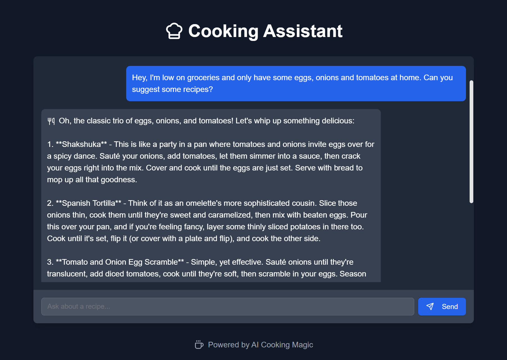

# Cooking Assistant Chatbot

Welcome to the Cooking Assistant Chatbot project! This application is designed to help users with cooking recipes, ingredient suggestions, and culinary advice in a fun and interactive way. The chatbot aims to make cooking a delightful experience.

## Features

- Suggest recipes based on available ingredients.
- Offer advice on ingredient substitutions.
- Propose fun and creative recipe themes.
- Provide a humorous and friendly interaction experience.

## Images




## Getting Started

### Prerequisites

- Node.js (version 16 or later)
- npm (Node Package Manager)

### Installation

1. **Clone the Repository:**

   ```bash
   git clone https://github.com/<your-username>/<repository-name>.git
   cd <repository-name>
   ```

2. **Install Dependencies:**

   Run the following command to install all necessary dependencies:

   ```bash
   npm install
   ```

3. **Environment Variables:**

   Create a `.env.local` file in the root of your project and add your Grok API key:

   ```plaintext
   XAI_API_KEY=your_grok_api_key_here
   ```

   Replace `your_grok_api_key_here` with your actual API key.

### Running the Project

To start the development server, run:

```bash
npm run dev
```

This will start the application on `http://localhost:3000`. You can open this URL in your browser to interact with the chatbot.

### Building for Production

To build the project for production, use:

```bash
npm run build
```

This will create an optimized production build of your application.

### Exporting Static Files

To export the project as static files (necessary for deployment on GitHub Pages), run:

```bash
npm run export
```

The static files will be generated in the `out` directory.

## Deployment

This project is set up to be deployed on GitHub Pages. Follow these steps to deploy:

1. **Push your code to GitHub.**
2. **Set up GitHub Actions** to automate the build and deployment process. Ensure your API key is stored as a secret in your GitHub repository settings.
3. **Monitor the deployment** process in the Actions tab of your GitHub repository.

## Contributing

Contributions are welcome! Please feel free to submit a pull request or open an issue if you have any suggestions or improvements.

## Acknowledgments

- Built with Next.js and deployed on GitHub Pages.

---

Enjoy cooking with your new assistant! If you have any questions or need further assistance, feel free to reach out.